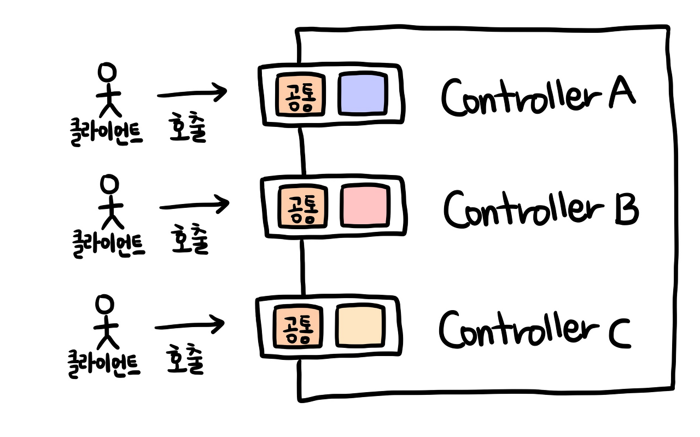

## DispatcherServlet의 배경
### MVC 패턴의 한계
- ### 1) forward 중복
    - View로 이동하는 코드 중복 호출
    ```
    RequestDispatcher dispatcher = request.getRequestDispatcher(viewPath);
    dispatcher.forward(request, response);
    ```
- ### 2) 사용하지 않는 코드
    - response 객체
    ```
    HttpServletRequest request, HttpServletResponse response
    ```
- ### 3) 공통 처리가 어렵다
    - 기능이 증가함에 따라 공통 처리 부분 증가

### Front Controller의 등장
- `정의` : 기존 MVC 패턴이 지니고 있던 단점들을 극복하기 위해 발전된 구조이다.
- 모든 클라이언트의 요청이 단일 진입점인 **FrontController**로 집중된다.

### Front Controller 특징
- `FrontControllerServlet` 하나로 클라이언트 요청을 받음
- `FrontController`가 요청에 맞는 컨트롤러를 찾아 호출
    - 이로 인해 공통 처리가 가능하다
- `FrontController`를 제외한 나머지 컨트롤러는 서블릿을 사용하지 않아도 된다

### Front Controller 도입 전


### Front Controller 도입 후


### Front Controller 예시

### 1) Front Controller 생성
```
import java.util.HashMap;
import java.util.Map;

@WebServlet(urlPatterns = "/*")
public class FrontController extends HttpServlet {
    private Map<String, Controller> controllerMap;

    public FrontController() {
        controllerMap = new HashMap<>();
        // URL과 컨트롤러 매핑
        controllerMap.put("/home", new HomeController());
        controllerMap.put("/user", new UserController());
        // 추가적인 URL과 컨트롤러 매핑
        // ...
    }
    
    @Override
    protected void service(HttpServletRequest request, HttpServletResponse response) throws ServletException, IOException {
    String uri = request.getRequestURI();
    String contextPath = request.getContextPath();
    String command = uri.substring(contextPath.length());

    Controller controller = controllerMap.get(command);
    
    if (controller != null) {
        String view = controller.handleRequest(request, response);
        if (view != null) {
            // 결과에 따른 .jsp 파일로 넘어가기
            request.getRequestDispatcher(view).forward(request, response);
        }
    } else {
        // 해당 URL에 맞는 컨트롤러가 없는 경우, 기본 처리
        controller = new DefaultController();
        String view = controller.handleRequest(request, response);
        if (view != null) {
            // 결과에 따른 .jsp 파일로 넘어가기
            request.getRequestDispatcher(view).forward(request, response);
        }
    }
}
}


```

### 2) 컨트롤러 인터페이스와 구현
```
// Controller interface
public interface Controller {
    String handleRequest(HttpServletRequest request, HttpServletResponse response);
}

// Home controller
public class HomeController implements Controller {
    @Override
    public String handleRequest(HttpServletRequest request, HttpServletResponse response) {
        // Home page logic
        // ...
        
        // Return the view path
        return "/home.jsp";
    }
}

// User controller
public class UserController implements Controller {
    @Override
    public String handleRequest(HttpServletRequest request, HttpServletResponse response) {
        // User-related logic
        // ...
        
        // view path 반환
        return "/user.jsp";
    }
}
```

## DispatcherServlet이란?
- `정의`: 웹 어플리케이션에서 Front Controller 패턴을 구현하는 방식 중 하나이다.

### DispatcherServlet의 요청 처리 단계
1. 클라이언트로부터 HTTP 요청이 도착하면 서블릿 컨테이너는 DispatcherServlet에 해당 요청을 전달
2. DispatcherServlet은 HandlerMapping을 사용하여 요청을 처리할 핸들러(컨트롤러)를 결정
3. DispatcherServlet은 HandlerAdapter를 사용하여 결정된 핸들러를 실행
4. DispatcherServlet은 ViewResolver를 사용하여 처리 결과를 적절한 뷰로 변환
5. DispatcherServlet은 변환된 뷰를 사용하여 클라이언트에게 응답을 생성

### DispatcherServlet 예시

### 1) DispatcherServlet 클래스 작성
```
public class DispatcherServlet extends HttpServlet {
    private HandlerMapping handlerMapping;
    private HandlerAdapter handlerAdapter;
    private ViewResolver viewResolver;

    @Override
    public void init() throws ServletException {
        // DispatcherServlet 초기화 작업
        handlerMapping = new HandlerMapping();
        handlerAdapter = new HandlerAdapter();
        viewResolver = new ViewResolver();
    }

    @Override
    protected void service(HttpServletRequest request, HttpServletResponse response) throws ServletException, IOException {
        // 클라이언트 요청 처리
        try {
            // 요청의 URL을 기반으로 핸들러(Controller)를 찾음
            Controller controller = handlerMapping.getHandler(request);
            // 핸들러 실행 및 처리 결과 얻기
            ModelAndView modelAndView = handlerAdapter.handle(request, response, controller);
            // ViewResolver를 통해 뷰를 찾고, 응답으로 반환
            viewResolver.resolveView(modelAndView, request, response);
        } catch (Exception e) {
            // 예외 처리
            // ...
        }
    }
    
    // ...
}
```

### 2) HandlerMapping 클래스 작성
- `정의` : 요청을 적절한 핸들러(컨트롤러)에 매핑하는 역할 담당한다.
```
public class HandlerMapping {
    private Map<String, Controller> handlerMap;

    public HandlerMapping() {
        handlerMap = new HashMap<>();
        // URL과 컨트롤러 매핑
        handlerMap.put("/user/list", new UserController());
        // 추가적인 URL과 컨트롤러 매핑
        // ...
    }

    public Controller getHandler(HttpServletRequest request) {
        String url = request.getRequestURI();
        return handlerMap.get(url);
    }
}

```

### 3) HandlerAdapter 클래스 작성
- `정의` : 핸들러(컨트롤러)를 실행하고 요청을 처리하는 역할을 수행한다.
```
public class HandlerAdapter {
    public ModelAndView handle(HttpServletRequest request, HttpServletResponse response, Controller controller) {
        try {
            // 컨트롤러 실행
            String view = controller.handleRequest(request, response);
            // 처리 결과를 ModelAndView에 저장
            ModelAndView modelAndView = new ModelAndView();
            modelAndView.setViewName(view);
            // 추가적인 처리
            // ...
            return modelAndView;
        } catch (Exception e) {
            // 예외 처리
            // ...
        }
        return null;
    }
}
```

### 4) ViewResolver 클래스 작성
- `정의` : ViewResolver는 요청 처리 결과를 뷰로 변환하여 응답으로 보내는 역할을 담당한다.
```
public class ViewResolver {
    public void resolveView(ModelAndView modelAndView, HttpServletRequest request, HttpServletResponse response) throws ServletException, IOException {
        String viewName = modelAndView.getViewName();
        // viewName에 해당하는 뷰 찾기
        String viewPath = getViewPath(viewName);
        // .jsp 파일로 forward
        request.getRequestDispatcher(viewPath).forward(request, response);
    }

    private String getViewPath(String viewName) {
        // viewName을 기반으로 실제 .jsp 파일의 경로를 결정하여 반환
        // 예: viewName이 "userList"일 경우 "/WEB-INF/views/userList.jsp"를 반환
        return "/WEB-INF/views/" + viewName + ".jsp";
    }
}
```

---

### 📢 면접 질문
1. DispatcherServlet의 역할은 무엇인가요?
2. DispatcherServlet과 Front Controller 패턴의 관계에 대해 설명해주세요.
3. DispatcherServlet의 동작 원리를 설명해주세요.
4. HandlerMapping과 HandlerAdapter의 역할은 무엇인가요? DispatcherServlet과 어떻게 협력하나요?
---

### 📌 References
- [로키의 개발 블로그](https://yejun-the-developer.tistory.com/4)
- [제이의 기억 저장소](https://traeper.tistory.com/198)
- 김영한 MVC 강의 추천!!!!!!!!!!
